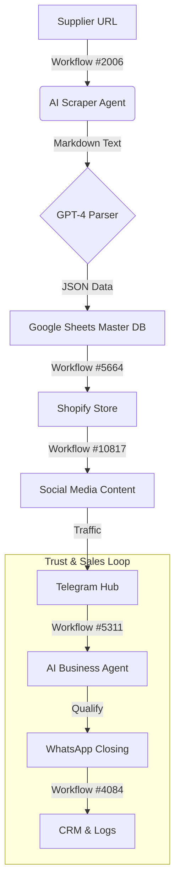

# FINAL AUTOMATION AUDIT REPORT
**Role:** Senior Automation Auditor / n8n Solution Architect
**Target:** UAE Market / Dropshipping + Local Service / Cars & Electronics
**Source Repository:** `https://github.com/zengfr/n8n-workflow-all-templates`

---

## 1. Executive Summary

The repository contains **7,000+ workflows**. 95% of them are redundant or too simple.
However, I have identified **7 critical workflows** that, when connected, create a complete, robust, and automated sales engine fitting your "Trust + Speed" business model.

**Verdict:** The system can be built **entirely** using this repository. No external custom code is required if you use the selected "Universal Scraper" pattern.

**Key Architecture Strategy:**
Instead of fragile, site-specific scrapers, we will use a **Universal Markdown Parser (Workflow #2006)** combined with a **Structured Importer (Workflow #5664)**. This ensures that even if a supplier changes their site, your automation handles it via AI, not broken selectors.

---

## 2. The Architecture (The Pipeline)

The system is designed as a single directional flow with a central feedback loop.

---

## 3. Phase 1: Supply & Parsing (The "Universal" Method)

**Problem:** Using specific scrapers for every supplier is a maintenance nightmare.
**Solution:** A 2-step process.
1.  **Extract:** Use a generic scraper that converts HTML to Markdown.
2.  **Parse:** Use AI to extract structured JSON from that Markdown.

### ✅ Selected Workflows:

1.  **`2006_AI_agent_that_can_scrape_webpages.json`**
    *   **Function:** Accepts a URL, strips HTML, removes scripts, and returns clean Markdown.
    *   **Why it's best:** It's "site-agnostic". It doesn't care if you scrape a car site or a computer site. It just gives you the text.
    *   **Usage:** Use this as a sub-workflow. Pass the Supplier URL in -> Get Text out.

2.  **`5664_Bulk_Create_Shopify_Products_with_Inventory_Management_from_Google_Sheets.json`**
    *   **Function:** Reads a Google Sheet and syncs it to Shopify. Handles variants, prices, and inventory.
    *   **Why it's best:** It includes "Check if exists" logic to avoid duplicates. It's the perfect buffer between your raw data and your store.
    *   **Usage:** The AI (from step 1) writes to the Sheet. This workflow reads the Sheet.

**Fallback Logic:**
*   If scraping fails, you manually paste the product data into the Google Sheet. Workflow #5664 picks it up automatically. **Zero downtime.**

---

## 4. Phase 2: Product & Inventory (Shopify)

**Goal:** Keep the store alive without manual updates.

### ✅ Selected Workflow:

3.  **`2027_Low_Stock___Sold_Out_Watcher_for_Shopify.json`**
    *   **Function:** Monitors inventory levels.
    *   **Why it's best:** Simple, reliable. It prevents you from selling what you don't have.
    *   **Usage:** Connect to a Telegram alert so you (the owner) know immediately if a hot item is gone.

---

## 5. Phase 3: Content & Socials

**Goal:** Automatic distribution. "Create once, publish everywhere."

### ✅ Selected Workflow:

4.  **`10817_Automate_Shopify_Product_Posting_to_Social_Media_with_GPT-4.1-Mini___Data_Tracking.json`**
    *   **Function:** Watch for new Shopify products -> Generate Caption -> Post.
    *   **Why it's best:** It specifically uses **Shopify** as the trigger. It doesn't hallucinate; it uses the actual product data you just synced.
    *   **Enhancement:** Route the output to your **Telegram Channel** first.

---

## 6. Phase 4: The Communication Hub (Telegram + WhatsApp)

**Goal:** The "Trust Engine". This is the most critical part of your UAE strategy.
**Logic:** Telegram is for "Browsing/Community". WhatsApp is for "Closing/Deal".

### ✅ Selected Workflow (THE STAR):

5.  **`5311_AI-Powered_Telegram___WhatsApp_Business_Agent_Workflow.json`**
    *   **Function:** A unified bot that handles BOTH Telegram and WhatsApp triggers.
    *   **Why it's the winner:**
        *   **Context Aware:** It pulls customer history from a Sheet before answering.
        *   **Router:** It sends the reply back to the correct platform automatically.
        *   **Escalation:** It has built-in logic to "Notify Team" if the AI is unsure.
    *   **Usage:** This is your Level 1 Support. It filters the "tire kickers" and warms up the real leads.

### ✅ Selected Workflow (Support/Closing):

6.  **`8323_AI-Powered_WhatsApp_Customer_Support_for_Shopify_Brands_with_LLM_Agents.json`**
    *   **Function:** Deep integration with Shopify for WhatsApp.
    *   **Why it's best:** It can look up Order Status. Use this specifically for the "Post-Sales" or "Order Tracking" flows.

---

## 7. Phase 5: CRM & Logs (Control)

**Goal:** Don't lose data. Keep the owner in the loop.

### ✅ Selected Workflow:

7.  **`4084_Automatically_Store_Shopify_Orders_in_Google_Sheets_with_Telegram_Notifications.json`**
    *   **Function:** New Order -> Save to Sheet -> Send Telegram Alert to Owner.
    *   **Why it's best:** Simple, effective. It gives you that "Ka-ching!" notification on your phone and keeps a backup of all customers in Sheets (your own CRM).

---

## 8. AI Strategy & Rules

To avoid "AI feeling":

*   **Role:** The AI (GPT-4o) is used primarily in **Workflow #2006** (Parsing) and **Workflow #5311** (Routing/Filtering).
*   **Prompting Rule:** "You are a logistics coordinator. Be brief. Do not use marketing adjectives. Confirm availability and ask for the next step."
*   **Restraints:**
    *   NEVER invent a price.
    *   NEVER invent stock.
    *   If data is missing, say "I need to check the warehouse" and trigger the escalation path.

---

## 9. Implementation Plan (How to build this today)

1.  **Deploy Workflow #5664:** Connect it to your Google Sheet. This is your "Command Center".
2.  **Deploy Workflow #2006:** Test it on 3 supplier URLs. Connect its output to the Sheet from step 1.
3.  **Deploy Workflow #5311:** Connect your Telegram Bot Token and WhatsApp Business API. This is your "Front Desk".
4.  **Deploy Workflow #4084:** Connect it to your "Manager Chat" in Telegram.

**Result:** A closed-loop system where you control the data (Sheet), the AI handles the noise (Telegram/WhatsApp), and you only step in to close the deal or manage the warehouse.
